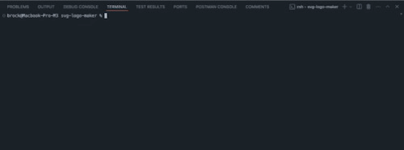

# SVG Logo Maker

## Description

The SVG Logo Maker is a Node.js command-line application that allows users to create customized SVG logos by entering simple prompts. Users can choose the logo text, text color, shape, and shape color to generate a personalized SVG file.

## How to Use

1. **Clone the Repository:**
   - Clone the project to your local machine using:
     ```bash
     git clone <repository-url>
     ```
2. **Install Dependencies:**

   - Navigate to the project directory and run:

   ```bash
    npm install
   ```

   ```bash
   npm install inquirer@8.2.4
   ```

   ```bash
   npm install jest
   ```

   ```bash
   npm install --save-dev jest
   ```

3. **Run the Application:**
   - Start the logo generator by running:
     ```bash
     node index.js
     ```
4. **Follow the Prompts:**
   - Enter the desired text (up to 3 characters).
   - Choose the text color (keyword or hexadecimal).
   - Select a shape (Circle, Triangle, or Square).
   - Specify the shape color (keyword or hexadecimal).
   - The application will generate an SVG logo based on your input and save it as `logo.svg` in the `examples` directory.

## Example Output

A sample logo generated by this application can be found at:

- `examples/logo.svg`


## Running Tests




The application includes unit tests to ensure functionality. Run the following command to execute the tests using Jest:

```bash
npm run test
```
